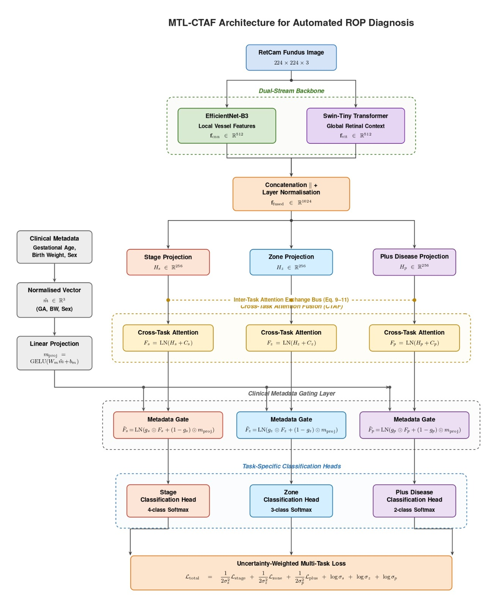

# MTL-CTAF-ROP: Automated Retinopathy of Prematurity Detection via Multi-Task Deep Learning

[](https://python.org)
[](https://pytorch.org)
[](https://kaggle.com)
[](LICENSE)

> A multi-task deep learning system for simultaneous classification of ROP Stage, Retinal Zone, and Plus Disease from neonatal fundus images — achieving **Stage AUC 0.979**, **Zone AUC 1.000**, and **Plus Disease AUC 1.000** on a held-out test set.

---

## Overview

Retinopathy of Prematurity (ROP) is a potentially blinding disease affecting premature infants. Early and accurate diagnosis requires simultaneous assessment of three interdependent clinical criteria:

- **Stage** (0–3): Severity of abnormal vessel growth
- **Zone** (I–III): Location of the disease in the retina
- **Plus Disease** (binary): Presence of abnormal vessel dilation/tortuosity

Manual grading by ophthalmologists is scarce, inconsistent, and unavailable in low-resource settings. This project proposes **MTL-CTAF-ROP**, a unified multi-task architecture that predicts all three labels jointly from a single retinal fundus image, augmented with clinical patient metadata.

---

## Architecture



The model consists of four key components:

### 1. Dual-Stream Backbone
Two pretrained encoders process the input image in parallel:
- **EfficientNet-B3** — captures local vessel texture features → **f_cnn ∈ ℝ⁵¹²**
- **Swin-Tiny Transformer** — captures global retinal context → **f_vit ∈ ℝ⁵¹²**

Their outputs are concatenated and layer-normalized into a **1024-dim fused representation**.

### 2. Cross-Task Attention Fusion (CTAF)
Each task head (Stage, Zone, Plus) projects the fused features into a 256-dim task-specific space. The **CTAF module** then applies scaled dot-product attention so each task attends to the representations of the other two:
F_s = LN(H_s + Attend(H_s → [H_z, H_p]))
F_z = LN(H_z + Attend(H_z → [H_s, H_p]))
F_p = LN(H_p + Attend(H_p → [H_s, H_z]))

This explicitly models the clinical interdependency between Stage, Zone, and Plus Disease.

### 3. Clinical Metadata Gating
Patient metadata (gestational age, birth weight, sex) is normalised and projected via GELU. A **learned sigmoid gate** blends visual features with clinical context for each task head:
F̃ = LN(g ⊙ F + (1−g) ⊙ m_proj)

### 4. Uncertainty-Weighted Multi-Task Loss
Task losses are balanced using **learnable log-variance parameters** (Kendall et al., NeurIPS 2018), avoiding manual loss weighting:
L_total = (1/2σ²_s)·L_stage + (1/2σ²_z)·L_zone + (1/2σ²_p)·L_plus + log σ_s + log σ_z + log σ_p

Per-class inverse-frequency weights are applied inside each cross-entropy loss to handle class imbalance.

---

## Results

Evaluated on a held-out patient-level test set (268 images, 10% of unique patients).

### Overall Performance

| Task | Accuracy | AUC (macro OvR) | Cohen's κ |
|---|---|---|---|
| Stage Classification (4-class) | 90.30% | **0.9793** | **0.8550** |
| Zone Classification (3-class) | 100.00% | **1.0000** | **1.0000** |
| Plus Disease Detection (binary) | 100.00% | **1.0000** | **1.0000** |

### Stage Classification Report

| Class | Precision | Recall | F1-Score | Support |
|---|---|---|---|---|
| Stage 0 | 0.7685 | 1.0000 | 0.8691 | 83 |
| Stage 1 | 1.0000 | 0.9652 | 0.9823 | 115 |
| Stage 2 | 1.0000 | 0.3750 | 0.5455 | 24 |
| Stage 3 | 0.9750 | 0.8478 | 0.9070 | 46 |
| **Weighted avg** | **0.9240** | **0.9030** | **0.8952** | **268** |

> **Note:** Zone and Plus Disease achieve perfect scores on this test set (268 images, 14 Plus cases). While results are strong, the small test cohort size means external validation on a larger, independent dataset is needed before clinical deployment.

---

## Key Design Decisions

| Decision | Rationale |
|---|---|
| Patient-level train/val/test split | Prevents data leakage across multiple images of the same patient |
| Dual-stream backbone | Combines local vessel texture (CNN) with global spatial context (Transformer) |
| CTAF attention | Exploits clinical correlation between Stage, Zone, and Plus |
| Metadata gating | Gestational age and birth weight are known ROP risk factors |
| Uncertainty loss weighting | Removes need for manual tuning of task loss weights |
| Mixed-precision training (AMP) | Reduces memory footprint; enables larger batch sizes on GPU |
| Cosine annealing LR | Smooth convergence; avoids sharp LR drops |

---

## Dataset

**Retinal Image Dataset of Infants and ROP**
- Source: [Kaggle — jananowakova/retinal-image-dataset-of-infants-and-rop](https://www.kaggle.com/datasets/jananowakova/retinal-image-dataset-of-infants-and-rop)
- Images: Neonatal RetCam fundus photographs
- Labels: Encoded in filenames (Stage, Zone, Plus Disease, patient ID, GA, BW, sex)
- Split: 80% train / 10% val / 10% test — **patient-level** (no patient appears in more than one split)

---

## Requirements

```bash
torch>=2.0
torchvision>=0.15
numpy
pandas
matplotlib
seaborn
scikit-learn
Pillow
opencv-python
```

---

## Usage

The full pipeline runs as a Kaggle notebook. Clone the repo and open in Kaggle with the dataset attached:

```python
# Key config
CFG.IMG_SIZE   = 224
CFG.BATCH_SIZE = 32
CFG.EPOCHS     = 30
CFG.LR         = 2e-4
CFG.PATIENCE   = 8      # early stopping
```

Training, evaluation, and GradCAM visualisation are all contained in `automated-rop-detection-multi-task-deep-learning.ipynb`.

---

## GradCAM Interpretability

GradCAM saliency maps are generated for all three task heads (Stage, Zone, Plus Disease) using the final convolutional block of EfficientNet-B3. This highlights which retinal regions drive each prediction — critical for clinical trust and model debugging.

---

## Limitations & Future Work

- Test set is small (268 images); results require validation on a larger external cohort
- Zone and Plus perfect scores likely reflect clean label separation in this dataset — not a guarantee of generalisation
- Future: multi-centre validation, prospective clinical trial integration, segmentation-guided attention

---

## Citation

If you use this work, please cite:
@misc{rajpurohit2025rop,
title   = {Automated ROP Detection via Multi-Task Deep Learning (MTL-CTAF-ROP)},
author  = {Parikshit Rajpurohit},
year    = {2025},
url     = {https://github.com/parikshit245/mtl-ctaf-rop}
}

---

## Author

**Parikshit Rajpurohit**
B.Tech Computer Engineering, PCCOE Pune
[LinkedIn](https://linkedin.com/in/parikshit-rajpurohit) · [GitHub](https://github.com/parikshit245)
